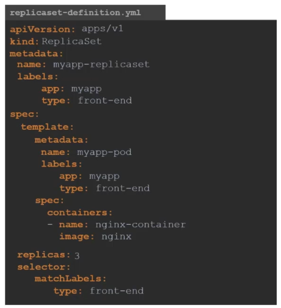

# ckad-certification-study

## Recap Pods with YAML

## Replica set
Yaml for replica set

### How to increase the number of replicas

1. Edit the yaml file increasing the replicas field and use the command below to update the configuration.

    `kubectl replace -f <pod-yaml-file.yaml>`

2. Use the scale command

    `kubectl scale --replicas=6 -f <pod-yaml-file.yaml>`
    `kubectl scale --replicas=6 replicaset myapp-replicaset`

## Commands used

    
    kubectl create -f <pod-yaml-file.yaml>

    kubectl get replicaset

    kubectl delete replicaset myapp-replicaset

    kubectl replace -f <pod-yaml-file.yaml>

    kubectl scale --replicas=6 -f <pod-yaml-file.yaml>

## Lab tips
In the lab there is a question asking to fix the replicaset yaml file. The replicaset `apiversion` is wrong. The steps below will help to find the correct apiVersion.

You can check for apiVersion of replicaset by using the command 

    kubectl api-resources | grep replicaset

You can also use the command below to correct the apiVersion for ReplicaSet.

    kubectl explain replicaset | grep VERSION