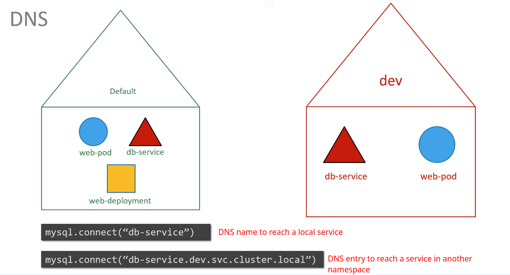

# ckad-certification-study

## Recap Pods with YAML


## Replica set
Yaml for replica set


### How to increase the number of replicas

1. Edit the yaml file increasing the replicas field and use the command below to update the configuration.

    `kubectl replace -f <pod-yaml-file.yaml>`

2. Use the scale command

    `kubectl scale --replicas=6 -f <pod-yaml-file.yaml>`
    `kubectl scale --replicas=6 replicaset myapp-replicaset`

## Commands used

    
    kubectl create -f <pod-yaml-file.yaml>

    kubectl get replicaset

    kubectl delete replicaset myapp-replicaset

    kubectl replace -f <pod-yaml-file.yaml>

    kubectl scale --replicas=6 -f <pod-yaml-file.yaml>

## Lab tips
In the lab there is a question asking to fix the replicaset yaml file. The replicaset `apiversion` is wrong. The steps below will help to find the correct apiVersion.

You can check for apiVersion of replicaset by using the command 

    kubectl api-resources | grep replicaset

You can also use the command below to correct the apiVersion for ReplicaSet.

    kubectl explain replicaset | grep VERSION

## Deployment
Use cases:
    - Deploy an application to a production environment with multiple pods
    - Upgrade app version as soon as there is a new version in Docker Hub. Deployment works with rolling updates, which updates one pods one after the other.
    - Possibility to roll-back changes
    - Scale, modify resources, updates can be done to the deployment setting instead of doing it for each pod.

### Commands used
    kubectl get deployment -n <namespace>
    kubectl get all -n <namespace>
    kubectl get pods -n <namespace>

### Lab tips
If you want to create the yaml file of a deployment, you can create it by using the following command
```
kubectl create deployment NAME --image=IMAGE --replicas=XX --dry-run=client -oyaml > FILENAME.yaml

# Example:
kubectl create deployment httpd-frontend --image=httpd:2.4-alpine --replicas=3 --dry-run=client -oyaml > my-deployment.yaml
```

## Namespaces




### Using namespaces when creating pods
How to create namespaces?

    kubectl create namespace dev


To create a pod in a different namespace like dev
    
    kubectl apply -f pod-definition.yaml --namespace=dev

You can also add the namespace field to the yaml pod definition.


To list pods on different namespaces

    kubectl get pods -n <namespace>
    kubectl get pods --namespace=<namespace>

How to switch to a namespace definetely when using kubectl?

    kubectl config set-context $(kubectl config current-context) --namespace=dev

To limite resources to namespaces we need to use Resource Quota


## Certification Tips

While you would be working mostly the declarative way – using definition files, imperative commands can help in getting one time tasks done quickly, as well as generate a definition template easily. This would help save considerable amount of time during your exams.

Before we begin, familiarize with the two options that can come in handy while working with the below commands:

`--dry-run` : By default as soon as the command is run, the resource will be created. If you simply want to test your command , use the --dry-run=client option. This will not create the resource, instead, tell you whether the resource can be created and if your command is right.

`-o yaml`: This will output the resource definition in YAML format on screen.

Use the above two in combination to generate a resource definition file quickly, that you can then modify and create resources as required, instead of creating the files from scratch.

#### POD

Create an NGINX Pod

    kubectl run nginx --image=nginx

Generate POD Manifest YAML file (-o yaml). Don’t create it(–dry-run)

    kubectl run nginx --image=nginx --dry-run=client -o yaml

#### Deployment

Create a deployment

    kubectl create deployment --image=nginx nginx

#### Generate Deployment YAML file (-o yaml). Don’t create it(–dry-run)

    kubectl create deployment --image=nginx nginx --dry-run -o yaml

####  Generate Deployment with 4 Replicas

    kubectl create deployment nginx --image=nginx --replicas=4

#### You can also scale a deployment using the kubectl scale command.

    kubectl scale deployment nginx --replicas=4

#### Another way to do this is to save the YAML definition to a file and modify

    kubectl create deployment nginx --image=nginx--dry-run=client -o yaml > nginx-deployment.yaml

You can then update the YAML file with the replicas or any other field before creating the deployment.

#### Service

Create a Service named redis-service of type ClusterIP to expose pod redis on port 6379

    kubectl expose pod redis --port=6379 --name redis-service --dry-run=client -o yaml

(This will automatically use the pod’s labels as selectors)

Or

    kubectl create service clusterip redis --tcp=6379:6379 --dry-run=client -o yaml

(This will not use the pods labels as selectors, instead it will assume selectors as app=redis. You cannot pass in selectors as an option. So it does not work very well if your pod has a different label set. So generate the file and modify the selectors before creating the service)

####  Create a Service named nginx of type NodePort to expose pod nginx’s port 80 on port 30080 on the nodes:

    kubectl expose pod nginx --port=80 --name nginx-service --type=NodePort --dry-run=client -o yaml

(This will automatically use the pod’s labels as selectors, but you cannot specify the node port. You have to generate a definition file and then add the node port in manually before creating the service with the pod.)

Or

    kubectl create service nodeport nginx --tcp=80:80 --node-port=30080 --dry-run=client -o yaml

(This will not use the pods labels as selectors)

Both the above commands have their own challenges. While one of it cannot accept a selector the other cannot accept a node port. I would recommend going with the `kubectl expose` command. If you need to specify a node port, generate a definition file using the same command and manually input the nodeport before creating the service.

Reference:

https://kubernetes.io/docs/reference/kubectl/conventions/

### Imperative Commands to be used in the certification

POD
Create an NGINX Pod

    kubectl run nginx --image=nginx

Generate POD Manifest YAML file (-o yaml). Don’t create it(–dry-run)

    kubectl run nginx --image=nginx --dry-run=client -o yaml

#### Deployment
Create a deployment

    kubectl create deployment --image=nginx nginx

Generate Deployment YAML file (-o yaml). Don’t create it(–dry-run)

    kubectl create deployment --image=nginx nginx --dry-run -o yaml

Generate Deployment with 4 Replicas

    kubectl create deployment nginx --image=nginx --replicas=4
    
You can also scale a deployment using the kubectl scale command.

    kubectl scale deployment nginx --replicas=4

Another way to do this is to save the YAML definition to a file and modify

    kubectl create deployment nginx --image=nginx--dry-run=client -o yaml > nginx-deployment.yaml

You can then update the YAML file with the replicas or any other field before creating the deployment.

Service
Create a Service named redis-service of type ClusterIP to expose pod redis on port 6379

    kubectl expose pod redis --port=6379 --name redis-service --dry-run=client -o yaml
    
(This will automatically use the pod’s labels as selectors)

Or

    kubectl create service clusterip redis --tcp=6379:6379 --dry-run=client -o yaml

(This will not use the pods labels as selectors, instead it will assume selectors as app=redis. You cannot pass in selectors as an option. So it does not work very well if your pod has a different label set. So generate the file and modify the selectors before creating the service)

Create a Service named nginx of type NodePort to expose pod nginx’s port 80 on port 30080 on the nodes:

    kubectl expose pod nginx --port=80 --name nginx-service --type=NodePort --dry-run=client -o yaml

(This will automatically use the pod’s labels as selectors, but you cannot specify the node port. You have to generate a definition file and then add the node port in manually before creating the service with the pod.)

Or

    kubectl create service nodeport nginx --tcp=80:80 --node-port=30080 --dry-run=client -o yaml

(This will not use the pods labels as selectors)

Both the above commands have their own challenges. While one of it cannot accept a selector the other cannot accept a node port. I would recommend going with the `kubectl expose` command. If you need to specify a node port, generate a definition file using the same command and manually input the nodeport before creating the service.
