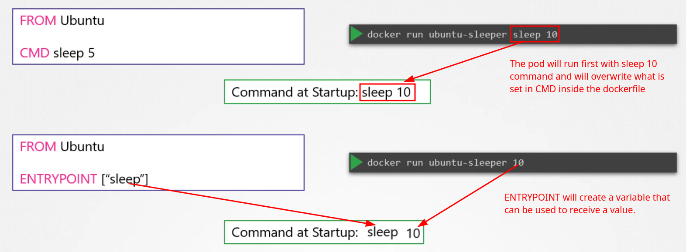
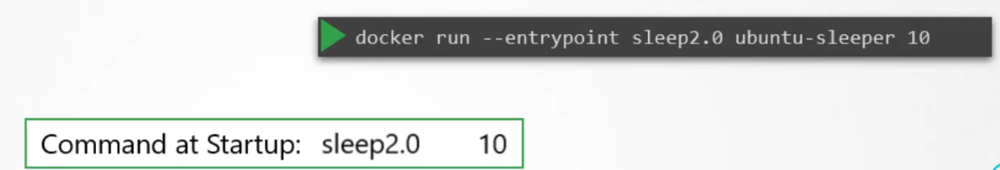

# Define, build and modify container images

## Stpes to create my own image

With the docker file we can proceed with:
    - define OS
    - Update the repo
    - Install dependencies
    - Install Python dependencies
    - copy source code to /opt folder
    - run the web server using "flask" command

1. Docker file
```yaml
FROM Ubuntu

RUN apt-get update
RUN apt-get install python

RUN pip install flask
RUN pip install flask-mysql

copy . /opt/source-code

ENTRYPOINT FLASK_APP=/opt/source-code/app.py flask run

```

2. Run the command to build the image in your local computer

    ```
    docker build dockerfilename -t rralmeid/my-custom-app .
    ```

    ```
    # Example

    Move to the directory first by using the cd command and verify the path of the working directory from pwd command :-

    $ cd /root/webapp-color/
    $ pwd
    /root/webapp-color
    Now, run the docker build command within that directory :-

    $ docker build -t webapp-color . 
    # NOTE: At the end of the command, we used the "." (dot) symbol which indicates for the current directory, so you need to run this command from within the directory that has the Dockerfile.

    ```

3. Push image to Docker Hub

    ```
    docker push rralmeid/my-custom-app
    ```

## Details about Dockerfile


Example using opensuse image

```yaml
# Use the official openSUSE image as the base
FROM opensuse

# Set the working directory inside the container
WORKDIR /app

# Copy files from the host to the container
COPY . /app

# Run a command to install dependencies (replace with your specific needs)
RUN zypper --non-interactive install <your_packages>

# Set the command to run when the container starts
CMD ["/app/your_application_script"]

#another option to CMD is ENTRYPOINT
ENTRYPOINT FLASK_APP=/opt/source-code/app.py flask run

```

### CMD section





This is a method to overwrite the Entrypoint command and the parameter.




> NOTE: In a Pod perspective, the `command` in the Pod yaml will replace the `ENTRYPOINT` field and the `args` will replace the `CMD`.

## Layered Archtecture


## Commands used

List of commands used in the lab

List the docker images present on the local computer. Can also be used to see Image ID, image Size, image Tag and Repository.

    docker image ls

Example to Run an instance of the image webapp-color and publish port 8080 on the container to 8282 on the host.

    docker run -p 8282:8080 webapp-color

How to connect to a container using docker.

    docker exec -it <Container-ID> sh 

You can also run a command immediately after creating a container.

    docker run python:3.6 cat /etc/*release*

## Note about editing pods in kubernetes

Remember, you CANNOT edit specifications of an existing POD other than the below.

- spec.containers[*].image

- spec.initContainers[*].image

- spec.activeDeadlineSeconds

- spec.tolerations

For example, you cannot edit the environment variables, service accounts, and resource limits (all of which we will discuss later) of a running pod. But if you really want to, you have two options:

1. Run the kubectl edit pod command. This will open the pod specification in an editor (vi editor). Then, edit the required properties. When you try to save it, you will be denied. This is because you are attempting to edit a field on the pod that is not editable.


A copy of the file with your changes is saved in a temporary location, as shown above.

You can then delete the existing pod by running the command:

    kubectl delete pod webapp

Then, create a new pod with your changes using the temporary file:

    kubectl create -f /tmp/kubectl-edit-ccvrq.yaml

2. The second option is to extract the pod definition in YAML format to a file using the command

Extracting YAML

    kubectl get pod webapp -o yaml > my-new-pod.yaml

Then, make the changes to the exported file using an editor (vi editor). Save the changes

    vi my-new-pod.yaml

Then, delete the existing pod.

    kubectl delete pod webapp

Then, create a new pod with the edited file.

    kubectl create -f my-new-pod.yaml

Edit Deployments
With Deployments, you can easily edit any field/property of the POD template. Since the pod template is a child of the deployment specification, with every change, the deployment will automatically delete and create a new pod with the new changes. So, if you are asked to edit a property of a POD part of a deployment, you may do that simply by running the command.

    kubectl edit deployment my-deployment